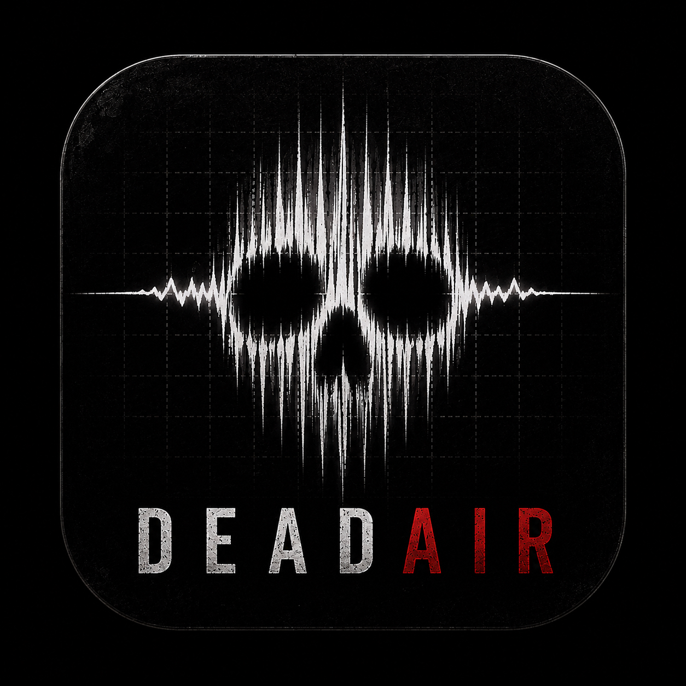

<p align="center">
  
</p>

# DeadAir

Fully-local, hold-to-talk voice dictation for Windows 11 — a self-hosted take on
Wispr Flow. Hold a key, speak, release: your words are transcribed on-device
(whisper.cpp with a Vulkan GPU backend, or faster-whisper on CPU), lightly
cleaned up by a local LLM through Ollama, and inserted at the cursor in whatever
app has focus. No audio, transcript, or text ever leaves your machine.

The app is a native C#/WPF tray program (the "host") that drives a long-running
Python ASR "sidecar" over a small stdio JSON protocol. The two halves keep their
models warm so a normal utterance goes from key-up to inserted text in a couple
of seconds.

---

## Features

- **Hold-to-talk global hotkey** — a low-level keyboard hook records only while
  the key is held (default **Right Ctrl**). Press → speak → release.
- **On-device speech recognition, two engines behind one interface:**
  - **GPU** — a whisper.cpp `whisper-server` subprocess built with the Vulkan
    backend, keeping a `large-v3-turbo` GGML model resident in VRAM (works on AMD
    with no CUDA/ROCm requirement).
  - **CPU** — `faster-whisper` (`small`, int8) in-process, the guaranteed-works
    baseline and automatic fallback.
  - `engine = auto` tries GPU first and degrades to CPU on any Vulkan/init
    failure, emitting a one-time "using CPU" toast — words are never lost.
- **Silence trimming (VAD)** — Silero VAD (via faster-whisper's vendored,
  onnxruntime-based copy, no PyTorch) drops non-speech before ASR.
- **Local LLM cleanup via Ollama** — the raw transcript is post-processed by a
  local model (default `qwen2.5:7b`) in one of two switchable modes:
  - **Faithful** (default) — removes fillers, fixes punctuation/casing/light
    grammar, keeps self-corrections, preserves wording and technical terms.
  - **Polished** — the above, plus light rephrasing of awkward/run-on sentences.
  - A **skip-guard** (default 50 chars) sends very short transcripts straight
    through un-cleaned, and if Ollama is down or slow the raw transcript is
    injected anyway (connect attempts are capped so a stopped Ollama fails over
    near-instantly).
- **Cursor injection** — clipboard-paste first (fast, format-safe), Unicode
  `SendInput` as a fallback (each UTF-16 code unit is sent, so emoji and other
  astral-plane characters go through as surrogate pairs). On a failed insert the
  text is left on the clipboard with a *press Ctrl+V* toast, so your dictation is
  never lost.
- **Live pill overlay (v0.2)** — while you hold the key, a small window shows a
  voice scope and a self-correcting interim transcript. Two selectable skins,
  both ported from DeadEye's node map: **Nebula** (default) — a bundle of
  smooth silvered-amber strands that fades in on press, fans wide and ripples
  with traveling waves while you speak, settles narrow when you pause (driven
  by loudness, not the literal waveform), and retracts on release; **Lantern**
  — the classic scrolling PCM oscilloscope as a warm phosphor double-stroke
  that ignites left→right, breathes while you speak, and retracts away. The
  interim text is a preview only and is never injected; the authoritative
  decode happens on key-up. (Scope on all engines; live text is GPU-only.)
- **Custom dictionary** — user terms bias both Whisper (as `initial_prompt`) and
  the LLM ("preserve these exactly").
- **System tray + settings** — mode toggle, ASR engine/model, Ollama model+URL,
  mic device, dictionary editor, scope skin picker, and three nebula dials
  (fan sensitivity, wiggle, wiggle speed). Settings apply live (the sidecar is
  hot-reconfigured); no restart needed except for a hotkey change.
- **Resilient by design** — single-instance guard, sidecar crash-restart with
  capped backoff, whisper-server self-heal/respawn, per-utterance timeout, and
  structured logging.

## How it works

```
DeadAir.App.exe (C#/.NET 8 WPF)            asr_sidecar (Python)
  hotkey hook, tray, settings   stdio        mic capture (sounddevice)
  config, orchestrator, inject  JSON-lines   Silero VAD
  Ollama HTTP client          <──────────>   engine selector:
                                               GPU → whisper-server (Vulkan)
        │ HTTP                                 CPU → faster-whisper
        ▼                                             │ spawns (GPU path)
  Ollama server (127.0.0.1:11434)                     ▼
  qwen2.5:7b, transcript cleanup            whisper-server, model warm in VRAM
```

The host owns everything Win32-native and user-facing; the sidecar owns
everything ASR-native and keeps the model warm between utterances (it is never
spawned per-utterance). Only small JSON control/result messages cross the
process boundary — raw PCM never does. See `docs/spec.md` for the full design,
IPC message table, and error-handling matrix.

## Project structure

```
host/                         C#/.NET 8 solution (DeadAir.slnx)
  DeadAir.App/                WPF tray app: App, tray, Settings + recording-indicator windows
  DeadAir.Core/               engine-agnostic host logic
    Hotkey/                   low-level keyboard hook + hold state machine + key map
    Sidecar/                  process manager, IPC commands/events, path resolver
    Cleanup/                  OllamaClient + prompt builder
    Inject/                   clipboard-paste + Unicode SendInput injectors
    Config/                   AppConfig schema + JSON store
    Orchestrator.cs           Idle→Recording→Transcribing→Cleaning→Injecting state machine
  DeadAir.Core.Tests/         xUnit tests
sidecar/                      Python ASR sidecar (package: asr_sidecar)
  asr_sidecar/
    __main__.py               IPC loop (run with `python -m asr_sidecar`)
    capture.py, audio.py      mic capture + WAV helpers
    vad.py                    Silero VAD wrapper
    engines/                  base + gpu_whispercpp + cpu_fasterwhisper + selector
    partials.py, waveform.py  live-pill interim decode + oscilloscope emitter
    ipc.py, config.py         stdio JSON protocol + sidecar config
  tests/                      pytest suite (incl. a jfk.wav fixture)
docs/                         spec.md + design/plan documents
models/                       GGML Whisper model goes here (gitignored)
tools/whisper/                whisper-server.exe goes here (gitignored)
```

## Requirements

- **Windows 11.** GPU path needs a Vulkan-capable GPU (developed on an AMD
  RX 6800 XT); CPU path works on any machine.
- **.NET 8 SDK** (host targets `net8.0-windows`, WPF).
- **Python 3.11+** for the sidecar.
- **Ollama** running locally (spec recommends ≥ 0.12.11) with the cleanup model
  pulled: `ollama pull qwen2.5:7b`.
- **For the GPU engine:** a Vulkan whisper.cpp `whisper-server.exe` in
  `tools/whisper/` and a GGML model at `models/ggml-large-v3-turbo.bin`. Both are
  gitignored — download or build them yourself (see `docs/spec.md` §7 for AMD
  build notes). Without them, `engine=auto` simply falls back to CPU.

## Setup

```powershell
# 1. Python sidecar
cd sidecar
python -m venv .venv
.venv\Scripts\pip install -r requirements.txt

# 2. Ollama cleanup model
ollama pull qwen2.5:7b

# 3. Build the host
cd ..\host
dotnet build -c Release

# 4. Run the built DeadAir.App.exe — a tray icon appears.
```

The host launches the sidecar itself (`python -m asr_sidecar`, using
`sidecar\.venv\Scripts\python.exe` by default) — you do not start it manually.
Relative asset paths in the config are resolved by walking up from the exe
directory, so Debug vs Release build depth doesn't matter.

## Usage

- **Hold Right Ctrl → speak → release.** Cleaned text lands at the cursor in the
  focused app.
- **Tray menu:** toggle **Polished mode** (unchecked = Faithful), open
  **Settings…**, or **Exit**.
- **Settings** lets you pick the ASR engine (auto/GPU/CPU), models, Ollama URL,
  mic device, and edit the custom dictionary.

## Configuration

Config lives at `%APPDATA%\DeadAir\config.json` (written the first time you save
Settings — defaults apply until then); logs at
`%APPDATA%\DeadAir\logs\deadair-YYYYMMDD.log`. Keys are camelCase. Selected
options:

| Section | Key | Default | Notes |
|---|---|---|---|
| `hotkey` | `key` | `RControl` | Single key only. Supported: `RControl`, `LControl`, `RAlt`, `LAlt`, `RShift`, `LShift`, `CapsLock`, `Scroll`, `Pause`, `F13`–`F24`. Unknown → falls back to `RControl`. Change requires app restart. |
| `asr` | `engine` | `auto` | `auto` \| `gpu` \| `cpu`. |
| `asr` | `gpuServerExe` / `gpuModelPath` | `..\..\tools\whisper\whisper-server.exe` / `..\..\models\ggml-large-v3-turbo.bin` | Resolved relative to the exe. |
| `asr` | `partials`, `partialIntervalMs`, `partialMinMs`, `partialWindowSeconds` | `true`, 600, 700, 30 | Live-pill interim decode (GPU only). |
| `ollama` | `url` / `model` | `http://127.0.0.1:11434` / `qwen2.5:7b` | `127.0.0.1`, not `localhost` (avoids a Winsock IPv6-first retry stall). |
| `ollama` | `numCtx`, `temperature`, `keepAlive`, `timeoutSeconds` | 8192, 0.1, `30m`, 20 | |
| `cleanup` | `mode` / `skipGuardChars` | `Faithful` / 50 | Transcripts shorter than the guard bypass the LLM. |
| `dictionary` | | `[]` | Terms to preserve exactly. |

**Reserved but not yet honored** (persisted, currently ignored):
`modeToggleHotkey`, `hotkey.mode` (hold is the only mode), and
`inject.method` / `inject.pasteHotkey` (injection is always
clipboard-paste with a SendInput fallback).

## Development / tests

```powershell
# Host tests (xUnit)
cd host
dotnet test

# Sidecar tests (pytest)
cd sidecar
.venv\Scripts\pip install -r requirements-dev.txt
.venv\Scripts\python -m pytest
```

Tests marked `slow` download models / need network on first run; `integration`
tests spawn real subprocesses.

## Known limitations

- **Elevated/admin windows:** Windows UIPI blocks a non-elevated app from typing
  or pasting into an elevated window. Injection fails silently and the text is
  left on the clipboard with a "press Ctrl+V" toast.
- **Hotkey changes require an app restart.**
- **Injection method is fixed** to clipboard-paste-then-SendInput; the
  method/paste-key config knobs are reserved for a future release.
- **Live interim text is GPU-only** — on the CPU engine you get the waveform but
  no live transcript.

## Status

Latest release **v0.2.1** (with a handful of unreleased fixes on `master`
targeting v0.2.2). v0.2.x delivers the full dictation loop plus the Phase 1
"live pill" (oscilloscope + interim transcript). Per `docs/spec.md`, later
phases scope per-app tone context, a voice-command mode, and polish items such
as a signed UIAccess build for elevated-window typing.

*DeadAir is a personal, local-first project and is not affiliated with Wispr
Flow or any other product.*